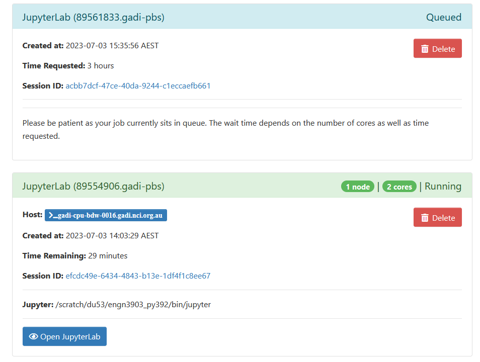

# Starting a JupyterLab Sesssion using the Australian Research Environment

## What is the Australian Research Environment (ARE)
In ENGN3903, we will exclusively use the JupyerLab app on ARE to conduct our weekly laboratory sessions.

The [ARE user-guide](https://opus.nci.org.au/display/Help/ARE+User+Guide) explains that the ARE is a web-based graphical interface for performing your computational research. It combines the familiarity of your regular desktop/laptop with the power of NCI’s world-class research HPC capabilities. ARE gives you access to NCI’s Gadi supercomputer and data collections, all from a simple, graphical interface. ARE consists of a number of applications that support your research such as Virtual Desktop, JupyterLab, Terminal, etc.

## Starting a JupyterLab session

The labs in ENGN3903 use a combination of Jupyterlab and Jupyter notebooks to explore remote-sensing concepts and datasets each week.  JupyterLab is a notebook authoring application and editing environment that includes may extensions and tools that make data exploration, control, and navigation easier. Jupyter notebooks are python computational notebooks that combine computer code, plain language descriptions, data, rich visualizations and interactive controls. A notebook, along with an editor like JupyterLab, provides a fast interactive environment for prototyping and explaining code, exploring and visualizing data, and sharing ideas with others.

To launch a Jupyterlab session and begin working through the Jupyter notebooks in this course, navigate to the ARE Dashboard:

    https://are.nci.org.au

Log in using your NCI account credentials. Once logged in, you will be redirected to the ARE dashboard. Click on the "Start a JuypterLab instance" icon. 

We then need to set up a few parameters to launch our Jupterlab session. Mimicking the screenshot below, fill out the following parameters:
* _Walltime_: `3` (this is how many hour your session will run)
* _Queue_: `normalbw` (the NCI-gadi queue where the session wil be hosted)
* _Project_: `du53` (the account under which the session will be accounted for)
* _Storage_: `scratch/du53` Which directory will be accessible during the session

The click 'Advanaced Options' and fill out the following:
 * _Modules_: `python3/3.9.2` (the version of python we'll use)
 * _Python or Conda virtual environment base_: `/scratch/du53/engn3903_py392` (the location where a python virtual environment has been set-up specially for this course)

Then **hit the blue "Lauch" icon** to request the session.  This will redirect you to another page where your session will sit in a queue waiting to be created (the first card in the image below). Once the session 'card' turns green and the ** "Open JupyterLab"** icon appears (the second card in the image below_, you are ready to start the session.  The JupyterLab session will open in a new tab on your browser when you click the icon. 

